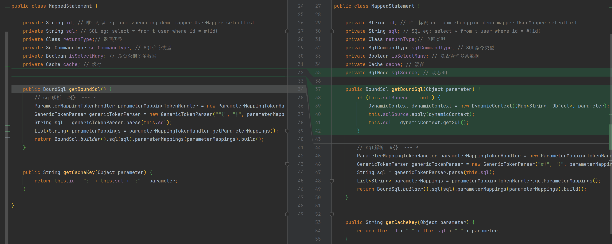
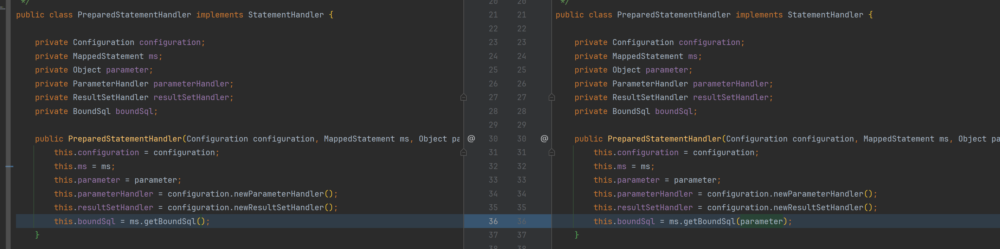

# 框架新增解析xml配置和动态sql-01

#### 1、mapper配置信息



```java
public class MappedStatement {
    // ...
    private SqlNode sqlSource; // 动态SQL

    public BoundSql getBoundSql(Object parameter) {
        if (this.sqlSource != null) {
            DynamicContext dynamicContext = new DynamicContext((Map<String, Object>) parameter);
            this.sqlSource.apply(dynamicContext);
            this.sql = dynamicContext.getSql();
        }
        // ...
    }
}
```

#### 2、预编译语句处理器



```java
public class PreparedStatementHandler implements StatementHandler {
    public PreparedStatementHandler(Configuration configuration, MappedStatement ms, Object parameter) {
        // ...
        this.boundSql = ms.getBoundSql(parameter);
    }
}
```

#### 3、XMLConfigBuilder 新增解析xml逻辑

```java
import cn.hutool.core.io.FileUtil;
import cn.hutool.core.util.ClassUtil;
import com.google.common.collect.Lists;
import com.zhengqing.mybatis.annotations.*;
import com.zhengqing.mybatis.cache.PerpetualCache;
import com.zhengqing.mybatis.mapping.MappedStatement;
import com.zhengqing.mybatis.mapping.SqlCommandType;
import com.zhengqing.mybatis.scripting.IfSqlNode;
import com.zhengqing.mybatis.scripting.MixedSqlNode;
import com.zhengqing.mybatis.scripting.SqlNode;
import com.zhengqing.mybatis.scripting.StaticTextSqlNode;
import com.zhengqing.mybatis.session.Configuration;
import lombok.SneakyThrows;
import org.dom4j.Document;
import org.dom4j.Element;
import org.dom4j.Node;
import org.dom4j.io.SAXReader;
import org.xml.sax.EntityResolver;
import org.xml.sax.InputSource;
import org.xml.sax.SAXException;

import java.io.BufferedInputStream;
import java.io.ByteArrayInputStream;
import java.io.IOException;
import java.lang.annotation.Annotation;
import java.lang.reflect.Method;
import java.lang.reflect.ParameterizedType;
import java.lang.reflect.Type;
import java.util.List;
import java.util.Set;

public class XMLConfigBuilder {

    private List<Class<? extends Annotation>> sqlAnnotationTypeList = Lists.newArrayList(Insert.class, Delete.class, Update.class, Select.class);

    public Configuration parse() {
        Configuration configuration = new Configuration();
        // 解析mapper
        this.parseMapper(configuration);
        this.parseMapperXml(configuration);
        return configuration;
    }

    @SneakyThrows
    private void parseMapper(Configuration configuration) {
        // ...
    }

    @SneakyThrows
    public void parseMapperXml(Configuration configuration) {
        // 解析xml
        SAXReader saxReader = new SAXReader();
        saxReader.setEntityResolver(new EntityResolver() {
            @Override
            public InputSource resolveEntity(String publicId, String systemId) throws SAXException, IOException {
                return new InputSource(new ByteArrayInputStream("<?xml version='1.0' encoding='UTF-8'?>".getBytes()));
            }
        });  // 跳过 xml DTD 验证 -- 解决解析慢的问题
        BufferedInputStream inputStream = FileUtil.getInputStream(System.getProperty("user.dir") + "/src/main/java/com/zhengqing/demo/mapper/UserMapper.xml");
        Document document = saxReader.read(inputStream);
        Element rootElement = document.getRootElement();
        String namespace = rootElement.attributeValue("namespace");
        List<Element> list = rootElement.selectNodes("//select"); // insert update delete select
        for (Element selectElement : list) {
            String methodName = selectElement.attributeValue("id");
            String resultType = selectElement.attributeValue("resultType");
            MixedSqlNode mixedSqlNode = this.parseTags(selectElement);

            Class<?> resultTypeClass = Class.forName(resultType);
            // 封装
            MappedStatement mappedStatement = MappedStatement.builder()
                    .id(namespace + "." + methodName)
                    .sql("")
                    .sqlSource(mixedSqlNode)
                    .returnType(resultTypeClass)
                    .sqlCommandType(SqlCommandType.SELECT)
                    .isSelectMany(false)
                    .cache(new PerpetualCache(resultTypeClass.getName()))
                    .build();
            configuration.addMappedStatement(mappedStatement);
        }
    }

    private MixedSqlNode parseTags(Element element) {
        List<SqlNode> contents = Lists.newArrayList();
        List<Node> contentList = element.content();
        for (Node node : contentList) {
            if (node.getNodeType() == Node.ELEMENT_NODE) {
                Element childNodeElement = (Element) node;
                String sqlNodeType = childNodeElement.getName();
                String test = childNodeElement.attributeValue("test");
//                System.out.println("类型：" + sqlNodeType);
//                System.out.println("表达式：" + test);

                if (sqlNodeType.equals("if")) {
                    contents.add(new IfSqlNode(test, this.parseTags(childNodeElement)));
                } else if (sqlNodeType.equals("choose")) {
//                contents.add(new ChooseSqlNode(test, this.parseTags(childNodeElement)));
                }
            } else {
                String sql = node.getText();
                contents.add(new StaticTextSqlNode(sql));
            }
        }
        return new MixedSqlNode(contents);
    }
}
```