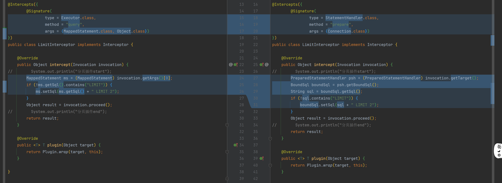

# 修复分页插件bug



```java
import com.zhengqing.mybatis.executor.statement.PreparedStatementHandler;
import com.zhengqing.mybatis.executor.statement.StatementHandler;
import com.zhengqing.mybatis.mapping.BoundSql;

import java.sql.Connection;

@Intercepts({
        @Signature(
                type = StatementHandler.class,
                method = "prepare",
                args = {Connection.class})
})
public class LimitInterceptor implements Interceptor {

    @Override
    public Object intercept(Invocation invocation) {
//        System.out.println("分页插件start");
        PreparedStatementHandler psh = (PreparedStatementHandler) invocation.getTarget();
        BoundSql boundSql = psh.getBoundSql();
        String sql = boundSql.getSql();
        if (!sql.contains("LIMIT")) {
            boundSql.setSql(sql + " LIMIT 2");
        }
        Object result = invocation.proceed();
//        System.out.println("分页插件end");
        return result;
    }

    @Override
    public <T> T plugin(Object target) {
        return Plugin.wrap(target, this);
    }

}
```