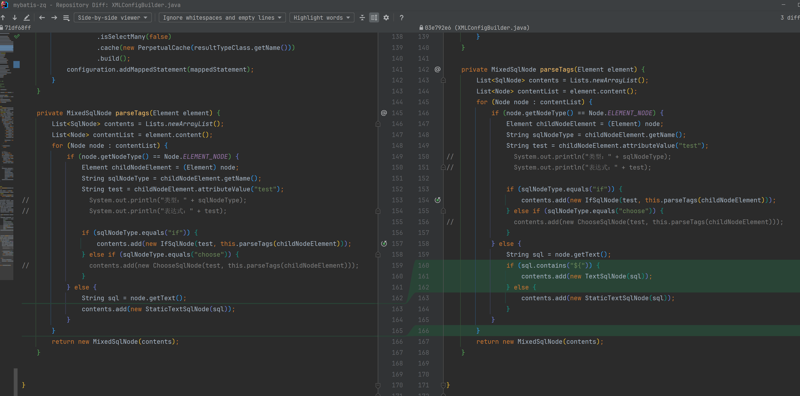

# TextSqlNode解析${}参数

#### 1、xml `${id}` 参数

```xml
<?xml version="1.0" encoding="UTF-8" ?>
<!DOCTYPE mapper PUBLIC "-//mybatis.org//DTD Mapper 3.0//EN"
        "https://mybatis.org/dtd/mybatis-3-mapper.dtd">

<mapper namespace="com.zhengqing.demo.mapper.UserMapper">
    <select id="findOne" resultType="com.zhengqing.demo.entity.User">
        select * from t_user
        <if test="id != null">
            where id = ${id}
            <if test="xx != null">
                limit 1
            </if>
        </if>
    </select>
</mapper>
```

#### 2、新增替换${}参数的标记处理器

```java
public class BindingTokenHandler implements TokenHandler {
    private DynamicContext context;

    public BindingTokenHandler(DynamicContext context) {
        this.context = context;
    }

    @SneakyThrows
    @Override
    public String handleToken(String content) {
        return String.valueOf(Ognl.getValue(content, this.context.getBindings()));
    }
}
```

#### 3、定义文本SQL节点 -- 直接替换${}参数值

```java
import com.zhengqing.mybatis.parsing.BindingTokenHandler;
import com.zhengqing.mybatis.parsing.GenericTokenParser;
import lombok.SneakyThrows;

public class TextSqlNode implements SqlNode {

    private String text; // eg: select * from t_user where id = ${id}

    public TextSqlNode(String text) {
        this.text = text;
    }

    @SneakyThrows
    @Override
    public void apply(DynamicContext context) {
        BindingTokenHandler tokenHandler = new BindingTokenHandler(context);
        GenericTokenParser genericTokenParser = new GenericTokenParser("${", "}", tokenHandler);
        String sql = genericTokenParser.parse(this.text);
        context.appendSql(sql);
    }

}
```

#### 4、XMLConfigBuilder sql节点解析判断



```
String sql = node.getText();
if (sql.contains("${")) {
    contents.add(new TextSqlNode(sql));
} else {
    contents.add(new StaticTextSqlNode(sql));
}
```
