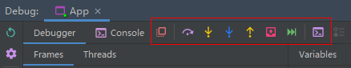

# debug-基础调试

从左到右依次如下

1. Show Execution Point (Alt + F10)：跳转到光标所在代码执行的行。
2. Step Over (F8)：步过，一行一行地往下走，如果这一行上有方法不会进入方法。
3. Step Into (F7)：步入，如果当前行有方法，可以进入方法内部，一般用于进入自定义方法内，不会进入官方类库的方法。
4. Force Step Into (Alt + Shift + F7)：强制步入，能进入任何方法，查看底层源码的时候可以用这个进入官方类库的方法。
5. Step Out (Shift + F8)：步出，从步入的方法内退出到方法调用处，此时方法已执行完毕，只是还没有完成赋值。
6. Drop Frame (默认无)：回退断点。
7. Run to Cursor (Alt + F9)：运行到光标处，你可以将光标定位到你需要查看的那一行，然后使用这个功能，代码会运行至光标行，而不需要打断点。
8. Evaluate Expression (Alt + F8)：计算表达式。