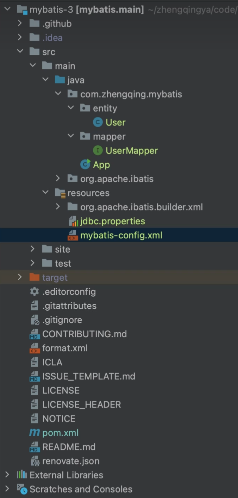

# 源码-准备环境



#### 依赖添加

```
<!--mysql驱动包-->
<dependency>
  <groupId>mysql</groupId>
  <artifactId>mysql-connector-java</artifactId>
  <version>5.1.40</version>
</dependency>

<!-- Hutool工具类 -->
<dependency>
  <groupId>cn.hutool</groupId>
  <artifactId>hutool-all</artifactId>
  <version>5.8.3</version>
</dependency>
```

#### jdbc.properties

```properties
jdbc.driver=com.mysql.jdbc.Driver
jdbc.url=jdbc:mysql://127.0.0.1:3306/mybatis-zq?allowMultiQueries=true&useUnicode=true&characterEncoding=UTF8&zeroDateTimeBehavior=convertToNull&useSSL=false
jdbc.username=root
jdbc.password=root
```

#### mybatis-config.xml

```xml
<?xml version="1.0" encoding="UTF-8" ?>
<!DOCTYPE configuration PUBLIC "-//mybatis.org//DTD Config 3.0//EN"
        "http://mybatis.org/dtd/mybatis-3-config.dtd">
<!-- 核心配置 -->
<configuration>
    <!-- 引入classpath下的jdbc的配置文件 -->
    <properties resource="jdbc.properties"></properties>

    <!-- environments：多个环境   development:开发 -->
    <environments default="development">
        <!-- 1个环境的配置，id:为这个环境取唯一一个id名称  注意：可配置多个环境 -->
        <environment id="development">
            <!--事务的管理:JDBC(支持事务)/MANAGED(什么都不做)-->
            <transactionManager type="JDBC"/>
            <!-- 数据源, 连接池  type(POOLED):MyBatis自带的连接池 -->
            <dataSource type="POOLED">
                <!-- 连接数据库的参数 -->
                <property name="driver" value="${jdbc.driver}"/>
                <property name="url" value="${jdbc.url}"/>
                <property name="username" value="${jdbc.username}"/>
                <property name="password" value="${jdbc.password}"/>
            </dataSource>
        </environment>
    </environments>
    <!-- 这个mappers代表的是相应的ORM映射文件 -->
    <mappers>
        <!-- 引入写sql语句的mapper配置文件  注意多个bean则引入多个mapper映射文件哦 -->
        <!--    <mapper resource="com/zhengqing/mybatis/mapper/UserMapper.xml"/>-->
        <package name="com.zhengqing.mybatis.mapper"/>
    </mappers>
</configuration>
```

#### User.java

```java
public class User {
    private Integer id;
    private String name;
    private Integer age;

    public User(Integer id, String name, Integer age) {
        this.id = id;
        this.name = name;
        this.age = age;
    }

    public Integer getId() {
        return this.id;
    }

    public void setId(Integer id) {
        this.id = id;
    }

    public String getName() {
        return this.name;
    }

    public void setName(String name) {
        this.name = name;
    }

    public Integer getAge() {
        return this.age;
    }

    public void setAge(Integer age) {
        this.age = age;
    }
}
```

#### UserMapper.java

```java
import com.zhengqing.mybatis.entity.User;
import org.apache.ibatis.annotations.Param;
import org.apache.ibatis.annotations.Select;

import java.util.List;

public interface UserMapper {
    @Select("select * from t_user where id = #{id} and name = #{name}")
    List<User> selectList(@Param("id") Integer id, @Param("name") String name);
}
```

#### App.java

```java
import cn.hutool.json.JSONUtil;
import com.zhengqing.mybatis.entity.User;
import com.zhengqing.mybatis.mapper.UserMapper;
import org.apache.ibatis.io.Resources;
import org.apache.ibatis.session.SqlSession;
import org.apache.ibatis.session.SqlSessionFactory;
import org.apache.ibatis.session.SqlSessionFactoryBuilder;

import java.io.IOException;
import java.io.InputStream;
import java.util.List;

public class App {
    public static void main(String[] args) throws IOException {
        String resource = "mybatis-config.xml";
        InputStream inputStream = Resources.getResourceAsStream(resource);
        SqlSessionFactory sqlSessionFactory = new SqlSessionFactoryBuilder().build(inputStream);
        SqlSession sqlSession = sqlSessionFactory.openSession();
        UserMapper userMapper = sqlSession.getMapper(UserMapper.class);
        List<User> userList = userMapper.selectList(1, "zq");
        System.out.println(JSONUtil.toJsonStr(userList));
    }
}
```

