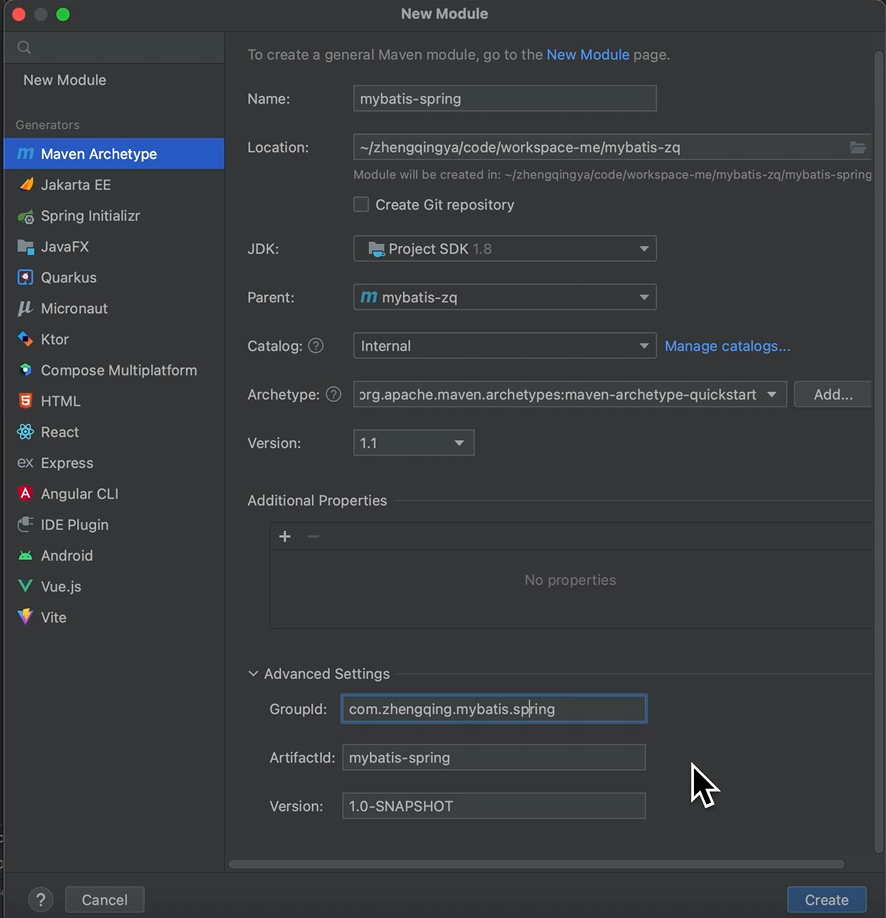
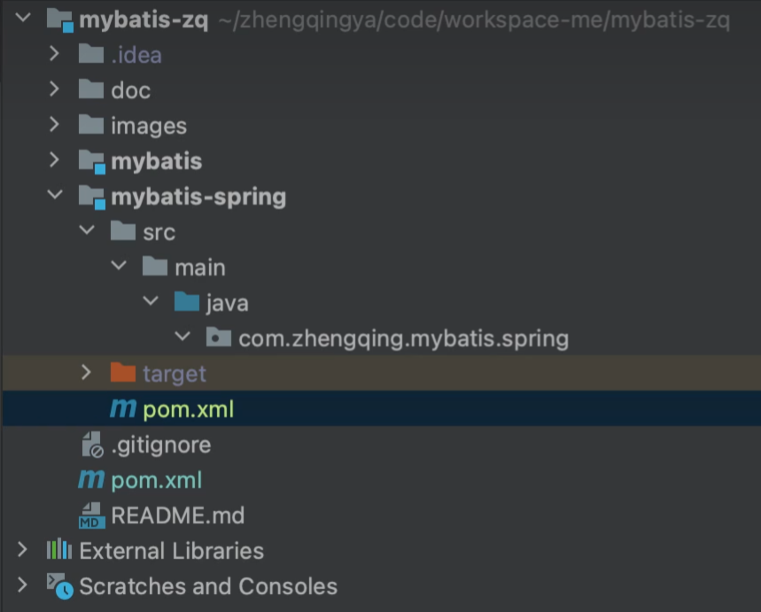

# 新建mybatis-spring模块



`mybatis-spring/pom.xml`

```xml

<project xmlns="http://maven.apache.org/POM/4.0.0" xmlns:xsi="http://www.w3.org/2001/XMLSchema-instance"
         xsi:schemaLocation="http://maven.apache.org/POM/4.0.0 http://maven.apache.org/xsd/maven-4.0.0.xsd">
    <modelVersion>4.0.0</modelVersion>
    <parent>
        <groupId>com.zhengqing.mybatis</groupId>
        <artifactId>mybatis-zq</artifactId>
        <version>1.0-SNAPSHOT</version>
    </parent>

    <groupId>com.zhengqing.mybatis.spring</groupId>
    <artifactId>mybatis-spring</artifactId>
    <packaging>jar</packaging>

    <name>mybatis-spring</name>
    <url>http://maven.apache.org</url>

    <dependencies>
        <!-- spring -->
        <dependency>
            <groupId>org.springframework</groupId>
            <artifactId>spring-context</artifactId>
            <version>5.3.15</version>
        </dependency>
        <!-- 事务 -->
        <dependency>
            <groupId>org.springframework</groupId>
            <artifactId>spring-tx</artifactId>
            <version>5.3.15</version>
        </dependency>
        <dependency>
            <groupId>org.springframework</groupId>
            <artifactId>spring-jdbc</artifactId>
            <version>5.3.15</version>
        </dependency>

        <!-- Druid数据源 -->
        <!-- https://github.com/alibaba/druid -->
        <dependency>
            <groupId>com.alibaba</groupId>
            <artifactId>druid</artifactId>
            <version>1.2.22</version>
        </dependency>
    </dependencies>
</project>
```

最后目录结构


