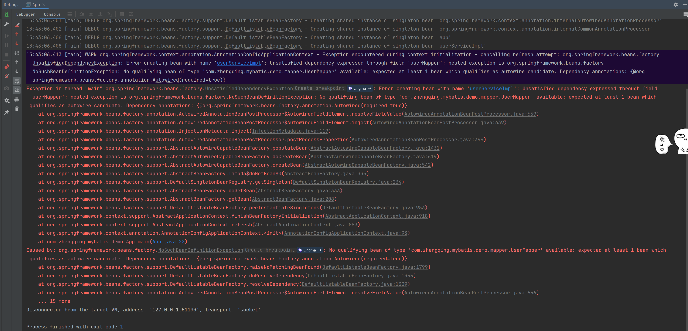

# 测试spring管理bean

#### 1、用户实体类

```java

@Data
@SuperBuilder
@AllArgsConstructor
@NoArgsConstructor
public class User {
    private Integer id;
    private String name;
    private Integer age;
}
```

#### 2、用户mapper

```java
public interface UserMapper {
    @Select("select * from t_user where id = #{id}")
    User findOne(@Param("id") Integer id);
}
```

#### 3、用户service

```java
public interface UserService {
    User findOne(Integer id);
}
```

```java
import org.springframework.beans.factory.annotation.Autowired;
import org.springframework.stereotype.Service;

@Service
public class UserServiceImpl implements UserService {
    @Autowired
    private UserMapper userMapper;

    @Override
    public User findOne(Integer id) {
        System.out.println("UserServiceImpl.findOne");
        User one = this.userMapper.findOne(id);
        return one;
    }
}
```

#### 4、测试类

```java
import org.springframework.context.annotation.AnnotationConfigApplicationContext;
import org.springframework.context.annotation.ComponentScan;

@ComponentScan("com.zhengqing.mybatis.demo")
public class App {
    public static void main(String[] args) {
        AnnotationConfigApplicationContext applicationContext = new AnnotationConfigApplicationContext(App.class);
        UserService userService = applicationContext.getBean(UserService.class);
        User user = userService.findOne(1);
        System.out.println(JSONUtil.toJsonStr(user));
    }
}
```

输出结果


```shell
Exception in thread "main" org.springframework.beans.factory.UnsatisfiedDependencyException: Error creating bean with name 'userServiceImpl': Unsatisfied dependency expressed through field 'userMapper'; nested exception is org.springframework.beans.factory.NoSuchBeanDefinitionException: No qualifying bean of type 'com.zhengqing.mybatis.demo.mapper.UserMapper' available: expected at least 1 bean which qualifies as autowire candidate. Dependency annotations: {@org.springframework.beans.factory.annotation.Autowired(required=true)}
	at org.springframework.beans.factory.annotation.AutowiredAnnotationBeanPostProcessor$AutowiredFieldElement.resolveFieldValue(AutowiredAnnotationBeanPostProcessor.java:659)
	at org.springframework.beans.factory.annotation.AutowiredAnnotationBeanPostProcessor$AutowiredFieldElement.inject(AutowiredAnnotationBeanPostProcessor.java:639)
	at org.springframework.beans.factory.annotation.InjectionMetadata.inject(InjectionMetadata.java:119)
	at org.springframework.beans.factory.annotation.AutowiredAnnotationBeanPostProcessor.postProcessProperties(AutowiredAnnotationBeanPostProcessor.java:399)
	at org.springframework.beans.factory.support.AbstractAutowireCapableBeanFactory.populateBean(AbstractAutowireCapableBeanFactory.java:1431)
	at org.springframework.beans.factory.support.AbstractAutowireCapableBeanFactory.doCreateBean(AbstractAutowireCapableBeanFactory.java:619)
	at org.springframework.beans.factory.support.AbstractAutowireCapableBeanFactory.createBean(AbstractAutowireCapableBeanFactory.java:542)
	at org.springframework.beans.factory.support.AbstractBeanFactory.lambda$doGetBean$0(AbstractBeanFactory.java:335)
	at org.springframework.beans.factory.support.DefaultSingletonBeanRegistry.getSingleton(DefaultSingletonBeanRegistry.java:234)
	at org.springframework.beans.factory.support.AbstractBeanFactory.doGetBean(AbstractBeanFactory.java:333)
	at org.springframework.beans.factory.support.AbstractBeanFactory.getBean(AbstractBeanFactory.java:208)
	at org.springframework.beans.factory.support.DefaultListableBeanFactory.preInstantiateSingletons(DefaultListableBeanFactory.java:953)
	at org.springframework.context.support.AbstractApplicationContext.finishBeanFactoryInitialization(AbstractApplicationContext.java:918)
	at org.springframework.context.support.AbstractApplicationContext.refresh(AbstractApplicationContext.java:583)
	at org.springframework.context.annotation.AnnotationConfigApplicationContext.<init>(AnnotationConfigApplicationContext.java:93)
	at com.zhengqing.mybatis.demo.App.main(App.java:22)
Caused by: org.springframework.beans.factory.NoSuchBeanDefinitionException: No qualifying bean of type 'com.zhengqing.mybatis.demo.mapper.UserMapper' available: expected at least 1 bean which qualifies as autowire candidate. Dependency annotations: {@org.springframework.beans.factory.annotation.Autowired(required=true)}
	at org.springframework.beans.factory.support.DefaultListableBeanFactory.raiseNoMatchingBeanFound(DefaultListableBeanFactory.java:1799)
	at org.springframework.beans.factory.support.DefaultListableBeanFactory.doResolveDependency(DefaultListableBeanFactory.java:1355)
	at org.springframework.beans.factory.support.DefaultListableBeanFactory.resolveDependency(DefaultListableBeanFactory.java:1309)
	at org.springframework.beans.factory.annotation.AutowiredAnnotationBeanPostProcessor$AutowiredFieldElement.resolveFieldValue(AutowiredAnnotationBeanPostProcessor.java:656)
	... 15 more
```

报错原因：Spring 容器中没有找到类型为 `com.zhengqing.mybatis.demo.mapper.UserMapper` 的 Bean，因此无法自动装配（autowire）到依赖该 Bean 的地方。

即：Spring 没有扫描到 UserMapper 接口所在的包。

解决方法：确保在 Spring 配置中正确配置了 Mapper 接口所在的包路径。可以通过 `@MapperScan` 注解或者 XML 配置来实现。

