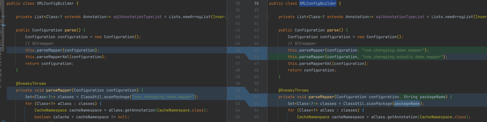
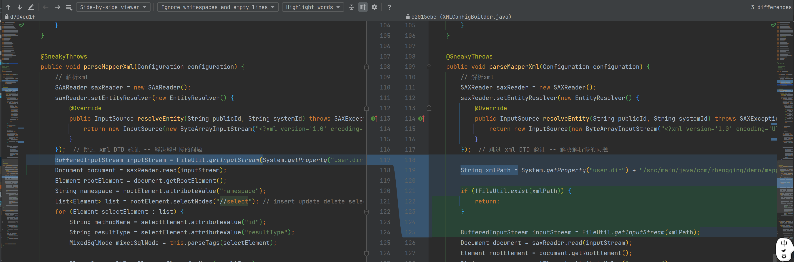

# Spring管理UserMapper

#### 1、定义mapper包扫描注解

```java
import org.springframework.context.annotation.Import;

import java.lang.annotation.ElementType;
import java.lang.annotation.Retention;
import java.lang.annotation.RetentionPolicy;
import java.lang.annotation.Target;

@Retention(RetentionPolicy.RUNTIME)
@Target(ElementType.TYPE)
@Import(MapperScannerRegistrar.class)
public @interface MapperScan {
    String value();
}
```

#### 2、自定义注册BeanDefinition

```java
import com.zhengqing.mybatis.demo.mapper.UserMapper;
import com.zhengqing.mybatis.spring.mapper.MapperFactoryBean;
import org.springframework.beans.factory.support.AbstractBeanDefinition;
import org.springframework.beans.factory.support.BeanDefinitionBuilder;
import org.springframework.beans.factory.support.BeanDefinitionRegistry;
import org.springframework.beans.factory.support.BeanNameGenerator;
import org.springframework.context.annotation.ImportBeanDefinitionRegistrar;
import org.springframework.core.type.AnnotationMetadata;

public class MapperScannerRegistrar implements ImportBeanDefinitionRegistrar {
    @Override
    public void registerBeanDefinitions(AnnotationMetadata importingClassMetadata, BeanDefinitionRegistry registry, BeanNameGenerator importBeanNameGenerator) {
        AbstractBeanDefinition beanDefinition = BeanDefinitionBuilder.genericBeanDefinition().getBeanDefinition();
        beanDefinition.setBeanClass(MapperFactoryBean.class);
        beanDefinition.getConstructorArgumentValues().addGenericArgumentValue(UserMapper.class);

        registry.registerBeanDefinition("userMapper", beanDefinition);
    }
}
```

#### 3、mapper工厂bean

用于自定义创建bean

```java
import com.zhengqing.mybatis.session.SqlSession;
import org.springframework.beans.factory.FactoryBean;
import org.springframework.beans.factory.annotation.Autowired;

public class MapperFactoryBean<T> implements FactoryBean<T> {
    private Class<T> mapperInterface;

    public MapperFactoryBean(Class<T> mapperInterface) {
        this.mapperInterface = mapperInterface;
    }

    @Autowired
    private SqlSession sqlSession;

    @Override
    public T getObject() throws Exception {
        return this.sqlSession.getMapper(this.mapperInterface);
    }

    @Override
    public Class<?> getObjectType() {
        return this.mapperInterface;
    }
}
```

#### 4、修改 XMLConfigBuilder -- mapper配置解析不同包下的xml扫描




#### 5、测试类

```java
import cn.hutool.json.JSONUtil;
import com.zhengqing.mybatis.demo.entity.User;
import com.zhengqing.mybatis.demo.service.UserService;
import com.zhengqing.mybatis.session.SqlSession;
import com.zhengqing.mybatis.session.SqlSessionFactory;
import com.zhengqing.mybatis.session.SqlSessionFactoryBuilder;
import com.zhengqing.mybatis.spring.annotation.MapperScan;
import org.springframework.context.annotation.AnnotationConfigApplicationContext;
import org.springframework.context.annotation.Bean;
import org.springframework.context.annotation.ComponentScan;

@ComponentScan("com.zhengqing.mybatis.demo")
@MapperScan("com.zhengqing.mybatis.demo.mapper")
public class App {
    @Bean
    public SqlSession sqlSession() {
        SqlSessionFactory sqlSessionFactory = new SqlSessionFactoryBuilder().build();
        SqlSession sqlSession = sqlSessionFactory.openSession();
        return sqlSession;
    }

    public static void main(String[] args) {
        AnnotationConfigApplicationContext applicationContext = new AnnotationConfigApplicationContext(App.class);
        UserService userService = applicationContext.getBean(UserService.class);
        User user = userService.findOne(1);
        System.out.println(JSONUtil.toJsonStr(user));
    }
}
```

输出结果

```shell
UserServiceImpl.findOne
select * from t_user where id = 1 LIMIT 2
{"id":1,"name":"zq","age":18}
```