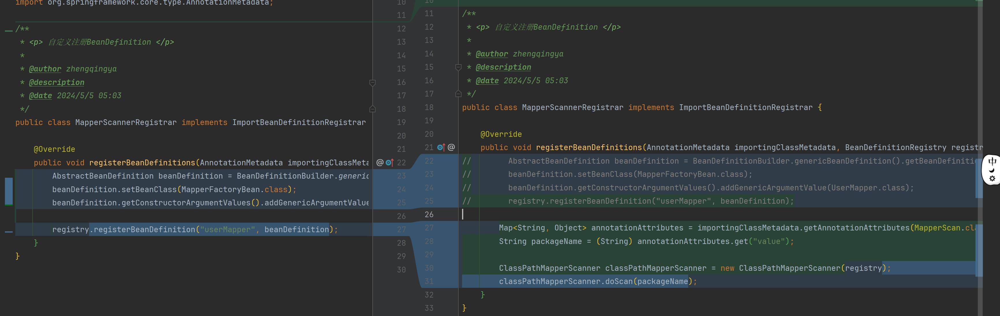

# Spring根据包扫描管理bean

#### 1、自定义扫描器

扫描指定包，发现并注册bean。

```java
import org.springframework.beans.factory.annotation.AnnotatedBeanDefinition;
import org.springframework.beans.factory.config.BeanDefinitionHolder;
import org.springframework.beans.factory.support.AbstractBeanDefinition;
import org.springframework.beans.factory.support.BeanDefinitionRegistry;
import org.springframework.context.annotation.ClassPathBeanDefinitionScanner;
import org.springframework.core.type.classreading.MetadataReader;

import java.io.IOException;
import java.util.Set;

public class ClassPathMapperScanner extends ClassPathBeanDefinitionScanner {
    public ClassPathMapperScanner(BeanDefinitionRegistry registry) {
        super(registry);
    }

    @Override
    protected boolean isCandidateComponent(MetadataReader metadataReader) throws IOException {
//        return super.isCandidateComponent(metadataReader); // 判断是否存在@Component注解
        return true;
    }

    @Override
    protected boolean isCandidateComponent(AnnotatedBeanDefinition beanDefinition) {
//        return super.isCandidateComponent(beanDefinition); // 判断是否不是接口
        return beanDefinition.getMetadata().isInterface();
    }

    @Override
    public Set<BeanDefinitionHolder> doScan(String... basePackages) {
        Set<BeanDefinitionHolder> beanDefinitionHolders = super.doScan(basePackages);
        for (BeanDefinitionHolder beanDefinitionHolder : beanDefinitionHolders) {
            AbstractBeanDefinition beanDefinition = (AbstractBeanDefinition) beanDefinitionHolder.getBeanDefinition();
            beanDefinition.getConstructorArgumentValues().addGenericArgumentValue(beanDefinition.getBeanClassName());
            beanDefinition.setBeanClass(MapperFactoryBean.class);
        }
        return beanDefinitionHolders;
    }
}
```

#### 2、MapperScannerRegistrar 修改 -- 根据包扫描注册bean



```java
import com.zhengqing.mybatis.spring.mapper.ClassPathMapperScanner;
import org.springframework.beans.factory.support.BeanDefinitionRegistry;
import org.springframework.beans.factory.support.BeanNameGenerator;
import org.springframework.context.annotation.ImportBeanDefinitionRegistrar;
import org.springframework.core.type.AnnotationMetadata;

import java.util.Map;

public class MapperScannerRegistrar implements ImportBeanDefinitionRegistrar {
    @Override
    public void registerBeanDefinitions(AnnotationMetadata importingClassMetadata, BeanDefinitionRegistry registry, BeanNameGenerator importBeanNameGenerator) {
//        AbstractBeanDefinition beanDefinition = BeanDefinitionBuilder.genericBeanDefinition().getBeanDefinition();
//        beanDefinition.setBeanClass(MapperFactoryBean.class);
//        beanDefinition.getConstructorArgumentValues().addGenericArgumentValue(UserMapper.class);
//        registry.registerBeanDefinition("userMapper", beanDefinition);

        Map<String, Object> annotationAttributes = importingClassMetadata.getAnnotationAttributes(MapperScan.class.getName());
        String packageName = (String) annotationAttributes.get("value");

        ClassPathMapperScanner classPathMapperScanner = new ClassPathMapperScanner(registry);
        classPathMapperScanner.doScan(packageName);
    }
}
```