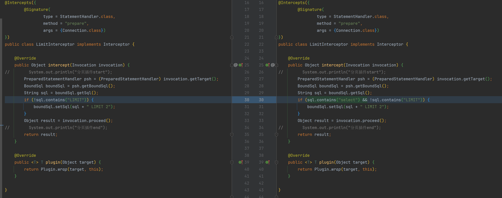

# 修复分页bug和测试spring事务

#### 修改分页bug

tips: 这里只是快速修复，实际真实业务中，肯定是不能这么写的，因为像insert语句中可能也会包含select,
eg: `INSERT INTO t2 (name, sex) SELECT name, sex FROM t1;`



#### 测试spring事务

```
@Override
@Transactional(rollbackFor = Exception.class)
public void save(User user) {
    System.out.println("UserServiceImpl.save");
    this.userMapper.insert(user);
    int a = 1 / 0;
}
```

测试结果：事务无效...

原因：目前手写mybatis框架中的事务是自己写的jdbc的事务，非spring事务管理。
