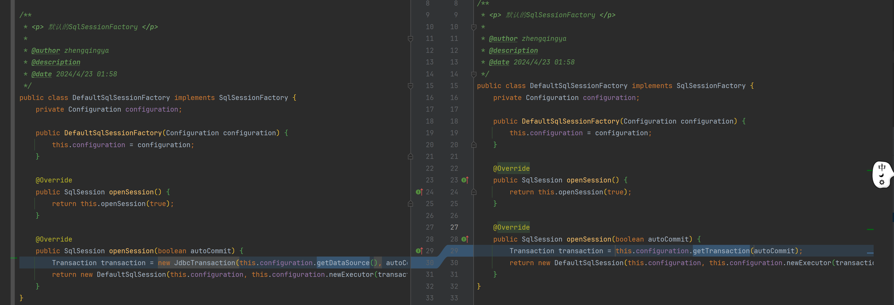

# spring事务管理-02

#### 1、Configuration 新增 Transaction 配置

```java
public class Configuration {
    // ...
    private Transaction transaction;
    private boolean isSpringTransaction = false;

    public void setTransaction(Transaction transaction) {
        this.transaction = transaction;
        this.isSpringTransaction = true;
    }

    public Transaction getTransaction(boolean autoCommit) {
        if (this.isSpringTransaction) {
            return this.transaction;
        }
        return new JdbcTransaction(this.dataSource, autoCommit);
    }
}
```

#### 2、DefaultSqlSessionFactory 通过 Configuration 获取事务



```java
public class DefaultSqlSessionFactory implements SqlSessionFactory {
    // ...
    @Override
    public SqlSession openSession(boolean autoCommit) {
        Transaction transaction = this.configuration.getTransaction(autoCommit);
        return new DefaultSqlSession(this.configuration, this.configuration.newExecutor(transaction));
    }
}
```

#### 3、XMLConfigBuilder 新增parse解析时传递 数据源&事务 参数

```java
public class XMLConfigBuilder {
    // ...
    public Configuration parse(DataSource dataSource, Transaction transaction) {
        Configuration configuration = this.parse();
        configuration.setDataSource(dataSource);
        configuration.setTransaction(transaction);
        return configuration;
    }
}
```

#### 4、SqlSessionFactoryBuilder 新增build 数据源&事务 参数

```java
public class SqlSessionFactoryBuilder {
    //...
    public SqlSessionFactory build(DataSource dataSource, Transaction transaction) {
        XMLConfigBuilder xmlConfigBuilder = new XMLConfigBuilder();
        Configuration configuration = xmlConfigBuilder.parse(dataSource, transaction);
        SqlSessionFactory sqlSessionFactory = new DefaultSqlSessionFactory(configuration);
        return sqlSessionFactory;
    }
}
```

#### 5、MyBatisConfig 注册sqlSession 自定义 数据源&事务

```java
public class MyBatisConfig {
    // ...
    @Bean
    public SqlSession sqlSession(DataSource dataSource) {
        SqlSessionFactory sqlSessionFactory = new SqlSessionFactoryBuilder().build(dataSource, new SpringManagedTransaction(dataSource));
        SqlSession sqlSession = sqlSessionFactory.openSession();
        return sqlSession;
    }
}
```

#### 6、测试

```
@Override
@Transactional(rollbackFor = Exception.class)
public void save(User user) {
    System.out.println("UserServiceImpl.save");
    this.userMapper.insert(user);
}
```
