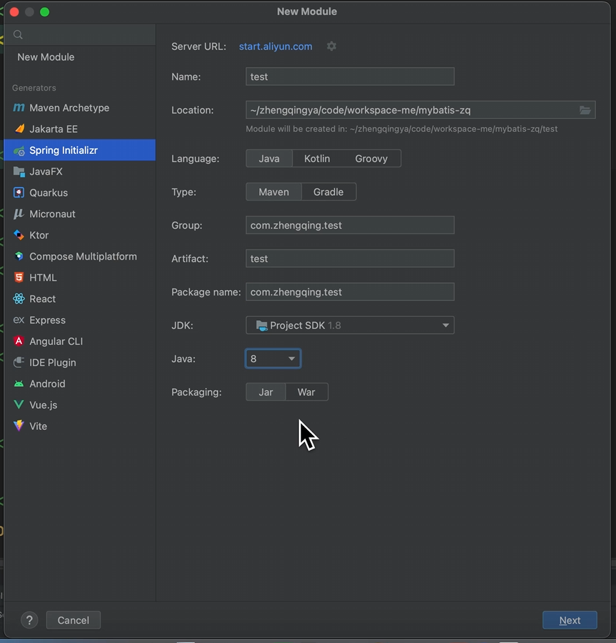

# 新建starter工程

### Spring Boot Starter 命名规范

在 Spring Boot 中，Starter 是一种简化配置的方式，它提供了一组默认配置，使得开发者可以快速集成和使用特定的功能或库。为了保持一致性和可读性，Spring Boot 对 Starter 的命名有特定的规范。

#### 命名规范

1. **前缀**：
    - 通常以 `spring-boot-starter-` 开头。
    - 例如：`spring-boot-starter-web`、`spring-boot-starter-data-jpa`。
2. **后缀**：
    - 通常以功能或库的名称作为后缀。
    - 例如：`spring-boot-starter-web`（用于 Web 开发）、`spring-boot-starter-data-jpa`（用于 JPA 数据访问）。
3. **避免重复**：
    - 避免使用 Spring Boot 官方已经提供的 Starter 名称。
    - 如果是第三方库的 Starter，通常会包含库的名称，例如 `mybatis-spring-boot-starter`。
4. **简洁明了**：
    - 名称应该简洁明了，能够清晰地表达 Starter 的功能或用途。

#### 示例

- **Spring 官方 Starter**：
    - `spring-boot-starter-web`：用于构建 Web 应用程序，包括 RESTful 服务。
    - `spring-boot-starter-data-jpa`：用于 JPA 数据访问。
    - `spring-boot-starter-security`：用于安全控制。
- **第三方 Starter**：
    - `mybatis-spring-boot-starter`：用于集成 MyBatis。
    - `spring-boot-starter-redis`：用于集成 Redis。

#### 自定义 Starter 命名示例

假设你要创建一个自定义的 Starter，用于集成某个名为 `my-library` 的库，可以命名为：

- `my-library-spring-boot-starter`

这样命名的好处是：

- 清晰地表明这是为 `my-library` 提供的 Spring Boot Starter。
- 避免与 Spring Boot 官方的 Starter 名称冲突。

### 工程创建

#### 1、新建starter工程


`pom.xml`

```xml
<?xml version="1.0" encoding="UTF-8"?>
<project xmlns="http://maven.apache.org/POM/4.0.0" xmlns:xsi="http://www.w3.org/2001/XMLSchema-instance"
         xsi:schemaLocation="http://maven.apache.org/POM/4.0.0 http://maven.apache.org/xsd/maven-4.0.0.xsd">
    <modelVersion>4.0.0</modelVersion>
    <parent>
        <groupId>com.zhengqing.mybatis</groupId>
        <artifactId>mybatis-zq</artifactId>
        <version>1.0-SNAPSHOT</version>
    </parent>

    <groupId>com.zhengqing.mybatis</groupId>
    <artifactId>mybatis-zq-spring-boot-starter</artifactId>
    <packaging>jar</packaging>

    <name>mybatis-zq-spring-boot-starter</name>
    <url>http://maven.apache.org</url>

    <dependencies>

    </dependencies>
</project>
```

#### 2、新建test工程



`pom.xml`

```xml
<?xml version="1.0" encoding="UTF-8"?>
<project xmlns="http://maven.apache.org/POM/4.0.0" xmlns:xsi="http://www.w3.org/2001/XMLSchema-instance"
         xsi:schemaLocation="http://maven.apache.org/POM/4.0.0 https://maven.apache.org/xsd/maven-4.0.0.xsd">
    <modelVersion>4.0.0</modelVersion>
    <parent>
        <groupId>com.zhengqing.mybatis</groupId>
        <artifactId>mybatis-zq</artifactId>
        <version>1.0-SNAPSHOT</version>
    </parent>

    <groupId>com.zhengqing.test</groupId>
    <artifactId>test</artifactId>
    <version>0.0.1-SNAPSHOT</version>
    <name>test</name>
    <description>test</description>

    <properties>
        <java.version>1.8</java.version>
        <project.build.sourceEncoding>UTF-8</project.build.sourceEncoding>
        <project.reporting.outputEncoding>UTF-8</project.reporting.outputEncoding>
        <spring-boot.version>2.7.0</spring-boot.version>
    </properties>

    <dependencyManagement>
        <dependencies>
            <dependency>
                <groupId>org.springframework.boot</groupId>
                <artifactId>spring-boot-dependencies</artifactId>
                <version>${spring-boot.version}</version>
                <type>pom</type>
                <scope>import</scope>
            </dependency>
        </dependencies>
    </dependencyManagement>

    <dependencies>
        <dependency>
            <groupId>org.springframework.boot</groupId>
            <artifactId>spring-boot-starter</artifactId>
        </dependency>

        <dependency>
            <groupId>org.springframework.boot</groupId>
            <artifactId>spring-boot-starter-test</artifactId>
            <scope>test</scope>
        </dependency>

        <dependency>
            <groupId>org.springframework.boot</groupId>
            <artifactId>spring-boot-starter-web</artifactId>
        </dependency>

        <dependency>
            <groupId>com.zhengqing.mybatis</groupId>
            <artifactId>mybatis-zq-spring-boot-starter</artifactId>
            <version>1.0-SNAPSHOT</version>
        </dependency>
    </dependencies>
</project>
```

`mybatis-zq` `pom.xml` 中添加test模块

```xml

<modules>
    // ...
    <module>test</module>
</modules>
```