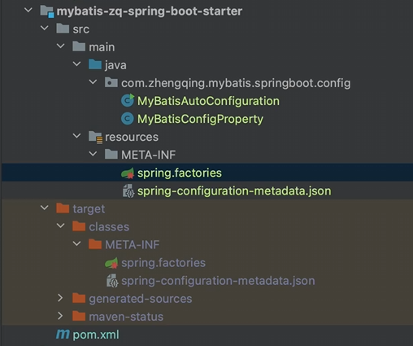

# 完善starter功能

### mybatis-zq-spring-boot-starter 工程



#### 1、`pom.xml` 依赖添加

```xml

<dependencies>
    <!-- 自动配置 -->
    <dependency>
        <groupId>org.springframework.boot</groupId>
        <artifactId>spring-boot-autoconfigure</artifactId>
        <version>2.7.0</version>
    </dependency>

    <!-- 生成配置元数据 - yml配置点击跳转 & 提示 -->
    <!-- tips: 编译时会自动生成对应配置 target/classes/META-INF -->
    <dependency>
        <groupId>org.springframework.boot</groupId>
        <artifactId>spring-boot-configuration-processor</artifactId>
        <version>2.7.0</version>
        <optional>true</optional>
    </dependency>

    <!-- lombok插件 -->
    <dependency>
        <groupId>org.projectlombok</groupId>
        <artifactId>lombok</artifactId>
        <version>1.18.24</version>
        <optional>true</optional>
    </dependency>

    <!-- Hutool工具类 -->
    <!-- https://mvnrepository.com/artifact/cn.hutool/hutool-all -->
    <dependency>
        <groupId>cn.hutool</groupId>
        <artifactId>hutool-all</artifactId>
        <version>5.8.3</version>
    </dependency>

    <dependency>
        <groupId>com.zhengqing.mybatis</groupId>
        <artifactId>mybatis</artifactId>
        <version>1.0-SNAPSHOT</version>
        <!--            <scope>system</scope>-->
        <!--            <systemPath>${pom.basedir}/../mybatis/target/mybatis.jar</systemPath>-->
    </dependency>

    <dependency>
        <groupId>com.zhengqing.mybatis</groupId>
        <artifactId>mybatis-spring</artifactId>
        <version>1.0-SNAPSHOT</version>
        <!--            <scope>system</scope>-->
        <!--            <systemPath>${pom.basedir}/../mybatis-spring/target/mybatis-spring.jar</systemPath>-->
    </dependency>
</dependencies>
```

#### 2、mybatis属性配置

```java
import lombok.Data;
import org.springframework.boot.context.properties.ConfigurationProperties;
import org.springframework.context.annotation.Configuration;

@Data
@Configuration
@ConfigurationProperties(prefix = "mybatis-zq")
public class MyBatisConfigProperty {
    /**
     * mapper包扫描路径
     */
    private String mapper;
}
```

#### 3、mybatis配置文件

```java
import ch.qos.logback.classic.Level;
import ch.qos.logback.classic.LoggerContext;
import cn.hutool.core.date.DateTime;
import com.alibaba.druid.pool.DruidDataSource;
import com.zhengqing.mybatis.demo.config.MyBatisConfig;
import com.zhengqing.mybatis.demo.entity.User;
import com.zhengqing.mybatis.demo.service.UserService;
import com.zhengqing.mybatis.session.SqlSession;
import com.zhengqing.mybatis.session.SqlSessionFactory;
import com.zhengqing.mybatis.session.SqlSessionFactoryBuilder;
import com.zhengqing.mybatis.spring.annotation.MapperScan;
import com.zhengqing.mybatis.spring.transaction.SpringManagedTransaction;
import org.slf4j.LoggerFactory;
import org.springframework.beans.factory.annotation.Autowired;
import org.springframework.boot.context.properties.EnableConfigurationProperties;
import org.springframework.context.annotation.AnnotationConfigApplicationContext;
import org.springframework.context.annotation.Bean;
import org.springframework.context.annotation.ComponentScan;
import org.springframework.jdbc.core.JdbcTemplate;
import org.springframework.jdbc.datasource.DataSourceTransactionManager;
import org.springframework.transaction.annotation.EnableTransactionManagement;

import javax.sql.DataSource;

@EnableTransactionManagement // 开启事务
@ComponentScan("com.zhengqing.mybatis.demo")
@MapperScan("com.zhengqing.mybatis.demo.mapper")
@EnableConfigurationProperties(MyBatisConfigProperty.class)
public class MyBatisAutoConfiguration {

    @Autowired
    private MyBatisConfigProperty myBatisConfigProperty;

    @Bean
    public SqlSession sqlSession(DataSource dataSource) {
        String mapper = this.myBatisConfigProperty.getMapper();
        SqlSessionFactory sqlSessionFactory = new SqlSessionFactoryBuilder().build(dataSource, new SpringManagedTransaction(dataSource));
        SqlSession sqlSession = sqlSessionFactory.openSession();
        return sqlSession;
    }

    // 创建数据库连接池
    @Bean
    public DataSource dataSource() {
        DruidDataSource dataSource = new DruidDataSource();
//        dataSource.setDriverClassName("com.mysql.cj.jdbc.Driver");
        dataSource.setUrl("jdbc:mysql://127.0.0.1:3306/mybatis-zq?useUnicode=true&characterEncoding=UTF8&useSSL=false");
        dataSource.setUsername("root");
        dataSource.setPassword("root");
        return dataSource;
    }

    // 创建 JdbcTemplate 对象
    @Bean
    public JdbcTemplate getJdbcTemplate(DataSource dataSource) {
        JdbcTemplate jdbcTemplate = new JdbcTemplate();
        jdbcTemplate.setDataSource(dataSource);
        return jdbcTemplate;
    }

    // 创建事务管理器
    @Bean
    public DataSourceTransactionManager getDataSourceTransactionManager(DataSource dataSource) {
        DataSourceTransactionManager transactionManager = new DataSourceTransactionManager();
        transactionManager.setDataSource(dataSource);
        return transactionManager;
    }


    public static void main(String[] args) {
        // Logback运行时动态更改日志级别
        LoggerContext loggerContext = (LoggerContext) LoggerFactory.getILoggerFactory();
        loggerContext.getLogger("ROOT").setLevel(Level.INFO);

        // spring应用上下文 -- 加载配置类，执行自动扫描
        AnnotationConfigApplicationContext applicationContext = new AnnotationConfigApplicationContext(MyBatisConfig.class);
        UserService userService = applicationContext.getBean(UserService.class);
//        System.out.println(JSONUtil.toJsonStr(userService.findOne(1)));
        userService.save(User.builder().name(DateTime.now() + "zq").age(18).build());
    }
}
```

#### 4、`resources\META-INF\spring.factories`

自动加载配置类：`com.zhengqing.mybatis.springboot.config.MyBatisAutoConfiguration`

```properties
# Auto Configure
org.springframework.boot.autoconfigure.EnableAutoConfiguration=\
com.zhengqing.mybatis.springboot.config.MyBatisAutoConfiguration
```

##### `spring.factories` 文件的作用

`spring.factories` 文件是 Spring Boot 中用于自动配置和扩展功能的重要配置文件。
它位于项目的 `src/main/resources/META-INF` 目录下，主要用于定义自动配置类、条件配置类、监听器以及其他扩展点。

主要作用

1. **自动配置类**：
    - 定义自动配置类，这些类会在 Spring Boot 应用启动时自动加载和配置。
    - 通过 `org.springframework.boot.autoconfigure.EnableAutoConfiguration` 键来指定自动配置类。
2. **条件配置类**：
    - 定义条件配置类，这些类会在满足特定条件时被加载。
    - 通过 `org.springframework.boot.autoconfigure.condition.ConditionalOnClass` 等注解来实现条件配置。
3. **监听器**：
    - 定义 Spring 应用的监听器，用于在应用启动或关闭时执行特定的操作。
    - 通过 `org.springframework.context.ApplicationListener` 键来指定监听器。
4. **其他扩展点**：
    - 定义其他 Spring Boot 扩展点，如 `org.springframework.boot.env.EnvironmentPostProcessor`、`org.springframework.boot.diagnostics.FailureAnalyzer` 等。

#### 5、`resources\META-INF\spring-configuration-metadata.json`

> tips：`spring-boot-configuration-processor` 依赖会在项目编译时 在target目录下自动生成此文件
> 

```json
{
  "groups": [
    {
      "name": "mybatis-zq",
      "type": "com.zhengqing.mybatis.springboot.config.MyBatisConfigProperty",
      "sourceType": "com.zhengqing.mybatis.springboot.config.MyBatisConfigProperty"
    }
  ],
  "properties": [
    {
      "name": "mybatis-zq.mapper",
      "type": "java.lang.String",
      "description": "mapper包扫描路径",
      "sourceType": "com.zhengqing.mybatis.springboot.config.MyBatisConfigProperty"
    }
  ],
  "hints": []
}
```

