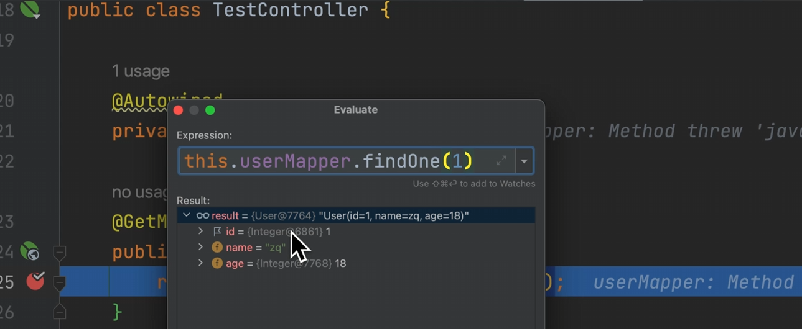

# 测试starter功能

### test 工程

#### application.yml

```yml
server:
  port: 83

mybatis-zq:
  mapper: com.zhengqing.test.mapper
```

#### 测试

```java
import com.zhengqing.mybatis.demo.mapper.UserMapper;
import org.springframework.beans.factory.annotation.Autowired;
import org.springframework.web.bind.annotation.GetMapping;
import org.springframework.web.bind.annotation.RequestMapping;
import org.springframework.web.bind.annotation.RestController;

@RestController
@RequestMapping("/api")
public class TestController {
    @Autowired
    private UserMapper userMapper;

    @GetMapping("/test")
    public Object test() {
        return this.userMapper.findOne(1);
    }
}
```


