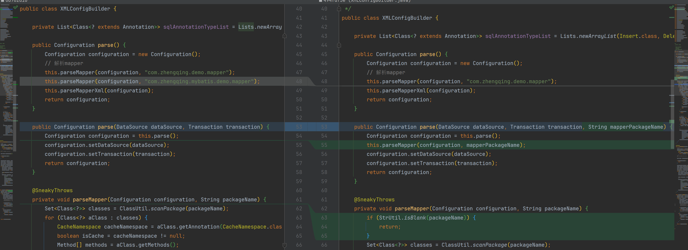

# starter完善mapper包扫描配置

#### 1、application.yml

```yml
mybatis-zq:
  mapper: com.zhengqing.test.mapper
```

#### 2、MyBatisAutoConfiguration 获取mapper配置包名并传递

```java

@EnableTransactionManagement // 开启事务
@EnableConfigurationProperties(MyBatisConfigProperty.class)
public class MyBatisAutoConfiguration {
    @Autowired
    private MyBatisConfigProperty myBatisConfigProperty;

    @Bean
    public SqlSession sqlSession(DataSource dataSource) {
        String mapper = this.myBatisConfigProperty.getMapper();
        SqlSessionFactory sqlSessionFactory = new SqlSessionFactoryBuilder().build(dataSource, new SpringManagedTransaction(dataSource), mapper);
        SqlSession sqlSession = sqlSessionFactory.openSession();
        return sqlSession;
    }
}
```

#### 3、SqlSessionFactoryBuilder

```java
public class SqlSessionFactoryBuilder {
    // ...
    public SqlSessionFactory build(DataSource dataSource, Transaction transaction, String mapperPackageName) {
        XMLConfigBuilder xmlConfigBuilder = new XMLConfigBuilder();
        Configuration configuration = xmlConfigBuilder.parse(dataSource, transaction, mapperPackageName);
        SqlSessionFactory sqlSessionFactory = new DefaultSqlSessionFactory(configuration);
        return sqlSessionFactory;
    }
}
```

#### 4、XMLConfigBuilder



```java
public class XMLConfigBuilder {
    // ...
    public Configuration parse(DataSource dataSource, Transaction transaction, String mapperPackageName) {
        Configuration configuration = this.parse();
        this.parseMapper(configuration, mapperPackageName);
        configuration.setDataSource(dataSource);
        configuration.setTransaction(transaction);
        return configuration;
    }
}
```

#### 5、启动类

```java
import com.zhengqing.mybatis.spring.annotation.MapperScan;

@SpringBootApplication
@MapperScan("com.zhengqing.test.mapper")
public class TestApplication {
    public static void main(String[] args) {
        SpringApplication.run(TestApplication.class, args);
    }
}
```

#### 6、测试

```java
package com.zhengqing.test.mapper;

public interface DemoMapper {
    @Select("select * from t_user where id = #{id}")
    User findOne(@Param("id") Integer id);
}
```

```java

@RestController
@RequestMapping("/api")
public class TestController {
    @Autowired
    private DemoMapper demoMapper;

    @GetMapping("/test")
    public Object test() {
        return this.demoMapper.findOne(1);
    }
}
```
