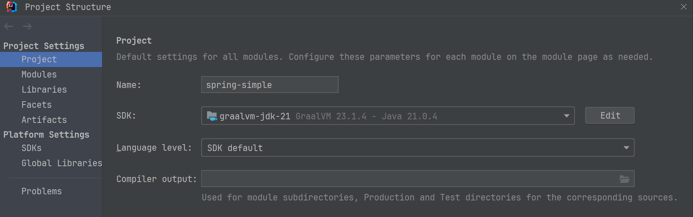
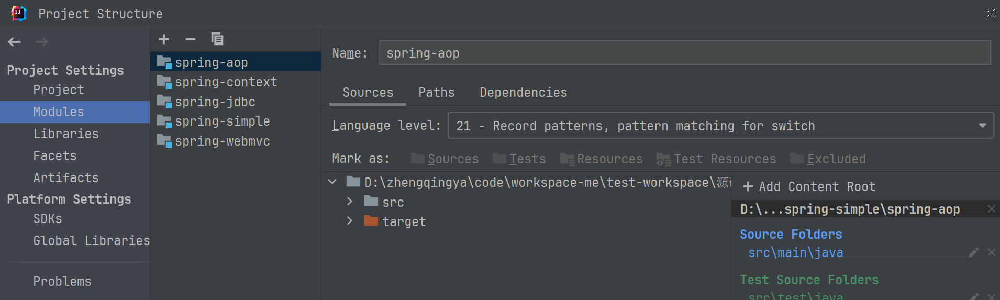

# 简介

- `spring-context`模块：实现ApplicationContext容器与Bean的管理
- `spring-aop`：实现AOP功能
- `spring-jdbc`：实现JdbcTemplate，以及声明式事务管理
- `spring-web`：实现Web MVC和REST API
- `spring-boot`：实现一个简化版的“Spring Boot”，用于打包运行

---

### 环境

jdk21

