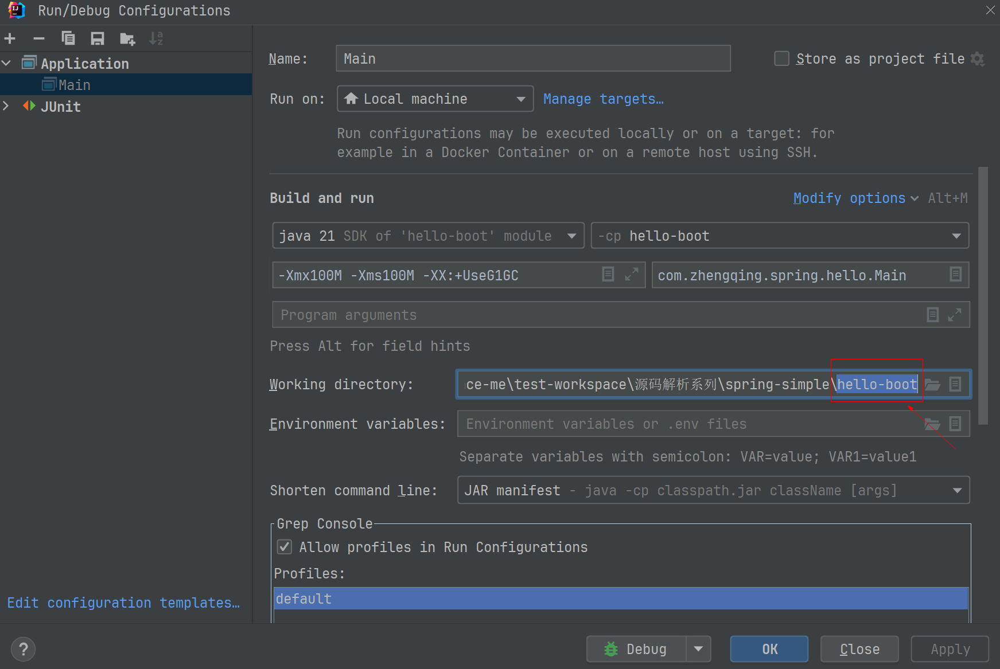

# 开发Boot应用

我们已经准备好boot模块了，下一步是使用boot来开发Web应用程序。

> tips: IDE单独打开`hello-boot`运行`Main` 或 在IDE运行程序时配置 jdk21 & 工作路径
> 


我们还是先定义一个符合Maven结构的Web应用程序`hello-boot`，先定义配置类`HelloConfiguration`：

```java

@ComponentScan
@Configuration
@Import({JdbcConfiguration.class, WebMvcConfiguration.class})
public class HelloConfiguration {
}
```

以及`UserService`、`MvcController`等业务Bean。

我们直接写个`main()`方法启动：

```java
public class Main {
    public static void main(String[] args) throws Exception {
        Application.run("src/main/webapp", "target/classes", HelloConfiguration.class, args);
    }
}
```

直接从IDE运行，是没有问题的，能顺利启动Tomcat、创建IoC容器、注册`Filter`和`DispatcherServlet`，可以直接通过浏览器访问。

但是，如果打一个war包，直接运行`java -jar xyz.war`是不行的！会直接报错：找不到Main这个class！

这是为什么呢？我们要从JVM的类加载机制说起。

当我们用`java`启动一个Java程序时，需要用`-cp`参数设置classpath（默认为当前目录`.`）；当我们用`java -jar xyz.jar`启动一个Java程序时，JVM忽略`-cp`参数，默认classpath为`xyz.jar`，这样，如果能在jar包中找到对应的class，就可以正常运行。

要注意的一点是，JVM从jar包加载class，是从jar包的根目录查找的。如果它要加载`com.itranswarp.hello.Main`，那么，`xyz.jar`必须按如下目录组织：

```
xyz.jar
└── com
    └── itranswarp
        └── hello
            └── Main.class
```

而我们在用Maven打war包时，结构是这样的：

```
xyz.war
└── WEB-INF
    └── classes
        └── com
            └── itranswarp
                └── hello
                    └── Main.class
```

自然无法加载`Main`。（注意jar包和war包仅扩展名不同，对JVM来说是完全一样的）

那为什么我们把`xyz.war`扔到Tomcat的webapps目录下就能正常运行呢？因为Tomcat启动后，并不使用JVM的ClassLoader加载class，而是为每个webapp创建一个单独的ClassLoader，这个ClassLoader在如下位置搜索class：

- WEB-INF/classes目录；
- WEB-INF/lib目录下的所有jar包。

因此，我们要运行的`xyz.war`包必须同时具有Web App的结构，又能在根目录下搜索到应用程序自己编写的`Main`：

```
xyz.jar
├── com
│   └── itranswarp
│       └── hello
│           └── Main.class
└── WEB-INF
    ├── classes
    └── libs
```

解决方案是在打包时复制所有编译的class到war包根目录，并添加启动类入口。修改`pom.xml`：

```
<project ...>
	...

	<build>
		<finalName>${project.name}</finalName>
		<plugins>
			<plugin>
				<groupId>org.apache.maven.plugins</groupId>
				<artifactId>maven-war-plugin</artifactId>
				<version>3.3.2</version>
				<configuration>
					<!-- 复制classes到war包根目录 -->
					<webResources>
						<resource>
							<directory>${project.build.directory}/classes</directory>
						</resource>
					</webResources>
					<archiveClasses>true</archiveClasses>
					<archive>
						<manifest>
							<!-- main启动类 -->
							<mainClass>com.itranswarp.hello.Main</mainClass>
						</manifest>
					</archive>
				</configuration>
			</plugin>
		</plugins>
	</build>
</project>
```

再次打包，运行，又会得到找不到Class的错误，不过这次是`Application`。

这又是什么原因呢？很明显`Main`已经找到了，但是`Application`在哪呢？它其实在`WEB-INF/lib/summer-boot-1.x.x.jar`，JVM不会在`WEB-INF/lib`下搜索Class，也不会在一个jar包内搜索“jar包内的jar包”。

怎么破？

答案是`Main`运行时先自解压，再让JVM能搜索到`WEB-INF/lib/summer-boot-1.x.x.jar`即可。

需要先修改`main()`方法代码：

```java
public static void main(String[] args) throws Exception {
    // 判定是否从jar/war启动:
    String jarFile = Main.class.getProtectionDomain().getCodeSource().getLocation().getFile();
    boolean isJarFile = jarFile.endsWith(".war") || jarFile.endsWith(".jar");
    // 定位webapp根目录:
    String webDir = isJarFile ? "tmp-webapp" : "src/main/webapp";
    if (isJarFile) {
        // 解压到tmp-webapp:
        Path baseDir = Paths.get(webDir).normalize().toAbsolutePath();
        if (Files.isDirectory(baseDir)) {
            Files.delete(baseDir);
        }
        Files.createDirectories(baseDir);
        System.out.println("extract to: " + baseDir);
        try (JarFile jar = new JarFile(jarFile)) {
            List<JarEntry> entries = jar.stream().sorted(Comparator.comparing(JarEntry::getName)).collect(Collectors.toList());
            for (JarEntry entry : entries) {
                Path res = baseDir.resolve(entry.getName());
                if (!entry.isDirectory()) {
                    System.out.println(res);
                    Files.createDirectories(res.getParent());
                    Files.copy(jar.getInputStream(entry), res);
                }
            }
        }
        // JVM退出时自动删除tmp-webapp:
        Runtime.getRuntime().addShutdownHook(new Thread(() -> {
            try {
                Files.walk(baseDir).sorted(Comparator.reverseOrder()).map(Path::toFile).forEach(File::delete);
            } catch (IOException e) {
                e.printStackTrace();
            }
        }));
    }
    Application.run(webDir, isJarFile ? "tmp-webapp" : "target/classes", HelloConfiguration.class, args);
}
```

再修改`pom.xml`，加上Classpath：

```
<project ...>
	...

	<build>
		<finalName>${project.name}</finalName>
		<plugins>
			<plugin>
				<groupId>org.apache.maven.plugins</groupId>
				<artifactId>maven-war-plugin</artifactId>
				<version>3.3.2</version>
				<configuration>
					<!-- 复制classes到war包根目录 -->
					<webResources>
						<resource>
							<directory>${project.build.directory}/classes</directory>
						</resource>
					</webResources>
					<archiveClasses>true</archiveClasses>
					<archive>
						<manifest>
							<!-- 添加Class-Path -->
							<addClasspath>true</addClasspath>
							<!-- Classpath前缀 -->
							<classpathPrefix>tmp-webapp/WEB-INF/lib/</classpathPrefix>
							<!-- main启动类 -->
							<mainClass>com.itranswarp.hello.Main</mainClass>
						</manifest>
					</archive>
				</configuration>
			</plugin>
		</plugins>
	</build>
</project>
```

当我们打包后，我们来分析启动流程。我们先把war包解压到`tmp-webapp`，它的结构如下：

```
tmp-webapp
├── META-INF
│   └── MANIFEST.MF
├── WEB-INF
│   ├── classes
│   ├── lib
│   │   ├── summer-boot-1.0.3.jar
│   │   └── ... other jars ...
│   └── templates
│       └── ... templates.html
├── application.yml
├── com
│   └── itranswarp
│       └── hello
│           ├── Main.class
│           └── ... other classes ...
├── favicon.ico
├── logback.xml
└── static
    └── ... static files ...
```

可见，`com/itranswarp/hello/Main.class`、`application.yml`、`logback.xml`都位于war包的根目录，可以被JVM的ClassLoader直接加载，而想要加载`WEB-INF/lib/summer-boot-1.x.x.jar`，我们需要给出Classpath。通过`java -jar xyz.war`启动时，虽然`-cp`参数无效，但JVM会自动从`META-INF/MANIFEST.MF`中读取`Class-Path`
条目，我们用Maven写入后内容如下：

```plain
Manifest-Version: 1.0
Created-By: Maven WAR Plugin 3.3.2
Build-Jdk-Spec: 17
Main-Class: com.itranswarp.hello.Main
Class-Path: tmp-webapp/WEB-INF/lib/summer-boot-1.0.3.jar tmp-webapp/WEB-
 INF/lib/summer-web-1.0.3.jar tmp-webapp/WEB-INF/lib/summer-context-1.0.
 3.jar tmp-webapp/WEB-INF/lib/snakeyaml-2.0.jar tmp-webapp/WEB-INF/lib/j
 ackson-databind-2.14.2.jar tmp-webapp/WEB-INF/lib/jackson-annotations-2
 .14.2.jar tmp-webapp/WEB-INF/lib/jackson-core-2.14.2.jar tmp-webapp/WEB
 -INF/lib/jakarta.annotation-api-2.1.1.jar tmp-webapp/WEB-INF/lib/slf4j-
 api-2.0.7.jar tmp-webapp/WEB-INF/lib/logback-classic-1.4.6.jar tmp-weba
 pp/WEB-INF/lib/logback-core-1.4.6.jar tmp-webapp/WEB-INF/lib/freemarker
 -2.3.32.jar tmp-webapp/WEB-INF/lib/summer-jdbc-1.0.3.jar tmp-webapp/WEB
 -INF/lib/summer-aop-1.0.3.jar tmp-webapp/WEB-INF/lib/byte-buddy-1.14.2.
 jar tmp-webapp/WEB-INF/lib/HikariCP-5.0.1.jar tmp-webapp/WEB-INF/lib/to
 mcat-embed-core-10.1.7.jar tmp-webapp/WEB-INF/lib/tomcat-annotations-ap
 i-10.1.7.jar tmp-webapp/WEB-INF/lib/tomcat-embed-jasper-10.1.7.jar tmp-
 webapp/WEB-INF/lib/tomcat-embed-el-10.1.7.jar tmp-webapp/WEB-INF/lib/ec
 j-3.32.0.jar tmp-webapp/WEB-INF/lib/sqlite-jdbc-3.41.2.1.jar
```

JVM会读取到`Main-Class`和`Class-Path`，由于已经解压，就能在`tmp-webapp`目录中顺利搜索到`tmp-webapp/WEB-INF/lib/summer-boot-1.x.x.jar`。后续Tomcat启动后，以`tmp-webapp`作为web目录本身就是标准的Web App，Tomcat的ClassLoader也能继续从`WEB-INF/lib`加载各种jar包。

我们总结一下，打包时做了哪些工作：

- 复制所有编译的class到war包根目录；
- 修改 `META-INF/MANIFEST.MF`：
    - 添加`Main-Class`条目；
    - 添加`Class-Path`条目。

运行时的流程如下：

1. JVM从war包加载Main类，执行`main()`方法；
2. 立刻自解压war包至`tmp-webapp`目录；
3. 后续加载`Application`时，JVM根据Class-Path能找到`tmp-webapp/WEB-INF/lib/summer-boot-1.x.x.jar`，因此可顺利加载；
4. 启动Tomcat，将`tmp-webapp`做为Web目录；
5. 作为Web App使用Tomcat的ClassLoader加载其他组件。

这样我们就实现了一个可以直接用`java -jar xyz.war`启动的Web应用程序！

有的同学会问，我们的boot应用，`main()`方法写了一堆自解压代码，而且，需要在`pom.xml`中配置很多额外的设置，对比Spring Boot应用，它对`main()`方法没有任何要求，而且，在`pom.xml`中也只需配置一个`spring-boot-maven-plugin`，没有其他额外配置，相比之下简单多了，那么，Spring Boot是如何实现的？

我们找一个Spring Boot打包的jar解压后就明白了，它的jar包结构如下：

```
xyz.jar
├── BOOT-INF
│   ├── classes
│   │   ├── application.yml
│   │   ├── logback-spring.xml
│   │   ├── static
│   │   │   └── ... static files ...
│   │   └── templates
│   │       └── ... templates ...
│   └── lib
│       ├── spring-boot-3.0.0.jar
│       └── ... other jars ...
├── META-INF
│   └── MANIFEST.MF
└── org
    └── springframework
        └── boot
            └── loader
                ├── JarLauncher.class
                └── ... other classes ...
```

Spring Boot并不能修改JVM的ClassLoader机制，因此，Spring Boot的jar包仍然需要在`META-INF/MANIFEST.MF`中声明`Main-Class`，只不过它声明的不是应用程序自己的`Main`，而是Spring Boot的`JarLauncher`：

```plain
Main-Class: org.springframework.boot.loader.JarLauncher
```

在jar包的根目录，JVM可以加载`JarLauncher`。一旦加载了`JarLauncher`后，Spring Boot会用自己的ClassLoader去加载其他的class和jar包，它在`BOOT-INF/classes`和`BOOT-INF/lib`下搜索。注意Spring Boot自定义的ClassLoader并不需要设置`Class-Path`，它可以完全自定义搜索路径，包括搜索“jar包中的jar包”。

因此，Spring Boot采用了两种机制来实现可执行jar包：

1. 提供Maven插件，自动设置`Main-Class`，复制相关启动Class，按`BOOT-INF`组织class和jar包；
2. 提供自定义的ClassLoader，可以在jar包中搜索`BOOT-INF/classes`和`BOOT-INF/lib`。

这样就使得编写Web应用程序时能简化打包和启动流程。
代价就是编写一个自定义的Maven插件和自定义的ClassLoader工作量很大，有兴趣的同学可以试着实现Spring Boot的机制。