### 一、前言

#### 资料

1. mybatis文档：[https://mybatis.org/mybatis-3/index.html](https://mybatis.org/mybatis-3/index.html)
2. mybatis源码：[https://github.com/mybatis/mybatis-3](https://github.com/mybatis/mybatis-3)

### 二、mybatis是什么？

1. 一款优秀的`持久层框架`，支持`自定义SQL`、`存储过程`以及`高级映射`。
2. `免除`了传统的`JDBC代码`以及`设置参数`和`获取结果集`的工作。
3. 可以通过`XML`/`注解`方式来`配置和映射` `原始类型`、`接口`和`Java POJO`为数据库中的记录。

mybatis和hibernate都属于`ORM`框架

###### ORM是什么？
ORM`对象关系映射`: `用于实现面向对象编程语言里不同类型系统数据之间的转换`，解决数据库与程序间的异构性

ex: `username`字段在数据库中为`VARCHAR`类型，而在Java对象中为`String`类型


### 三、入门环境准备

这里可直接参考mybatis文档：[https://mybatis.org/mybatis-3/getting-started.html](https://mybatis.org/mybatis-3/getting-started.html)

小编这里使用的是mybatis源码环境，即 将源码clone下来根据文档入门实现了一个简单的sql查询

> 详细代码可自行参考： [https://gitee.com/zhengqingya/java-workspace](https://gitee.com/zhengqingya/java-workspace)


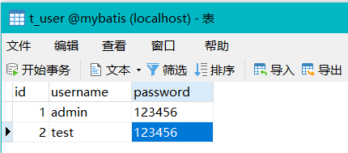
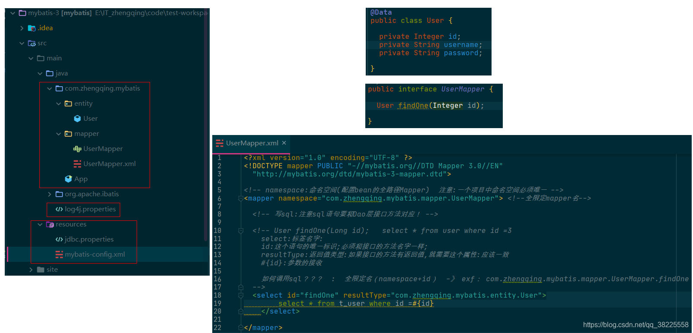
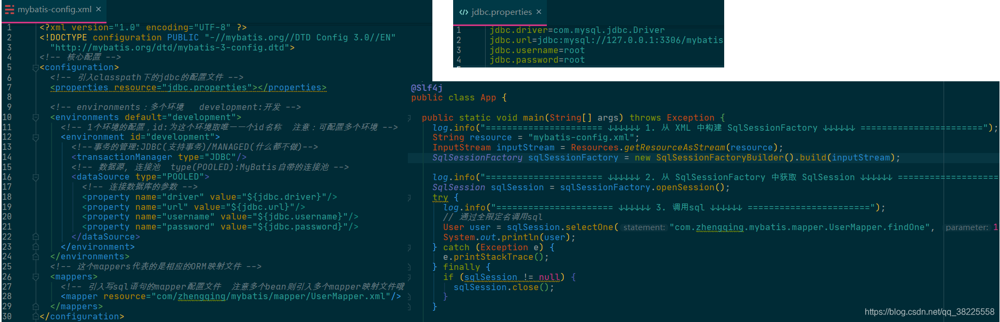


---


下面将通过debug一步一步探索源码，主要将围绕如图3大模块来debug


### 四、mybatis获取数据源

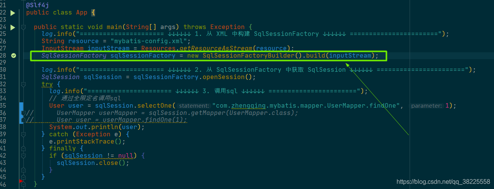

这里的root即拿到的配置文件中的内容，然后一个一个去解析加载数据

`propertiesElement(root.evalNode("properties"))`：加载`jdbc.properties`配置文件中数据
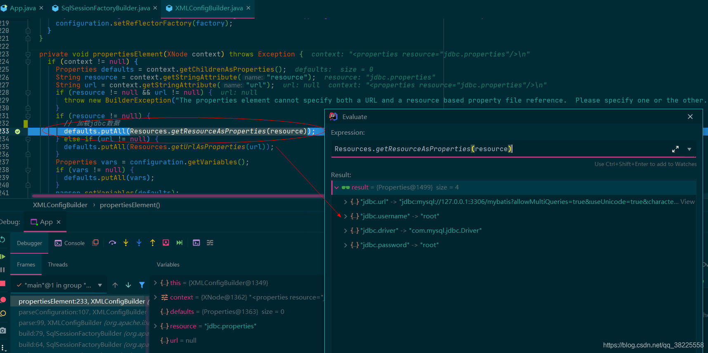
执行完，到`environmentsElement(root.evalNode("environments"))`方法处，即已经拿到我们配置文件的数据源信息

然后进入`dataSourceElement(child.evalNode("dataSource"))`

再进入`resolveClass`，发现通过`pooled`这个key可以拿到`org.apache.ibatis.datasource.pooled.PooledDataSourceFactory`

回来我们可以发现获取到的这个`pooled`值value，也就是`org.apache.ibatis.datasource.pooled.PooledDataSourceFactory`Class类再newInstance拿到`DataSourceFactory`这么一个实例

```java
DataSourceFactory factory = (DataSourceFactory) resolveClass(type).getDeclaredConstructor().newInstance();
```

最终返回，即发现已经拿到了我们的`dataSource`数据库源，然后通过Builder设计模式赋值给`Environment`，存放到`org.apache.ibatis.session.Configuration#environment`
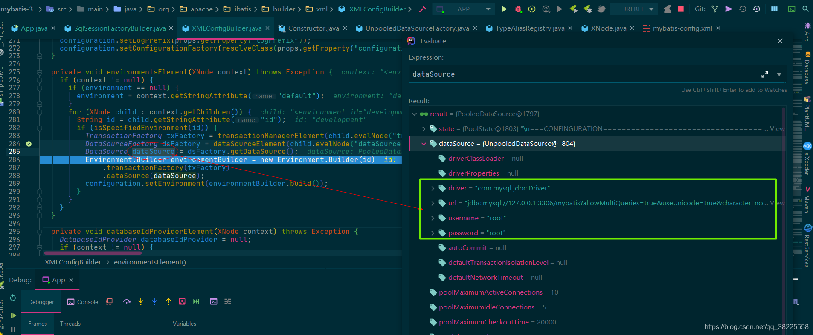

### 五、mybatis获取sql执行语句

首先要明白我们的sql语句是写在mapper.xml中，然后是在`mybatis-config.xml`中解析，因此debug 查看`org.apache.ibatis.builder.xml.XMLConfigBuilder#parseConfiguration` 方法中的 `mapperElement(root.evalNode("mappers"))`

这里因为只有`resource`，因此走如下断点处方式解析mapper
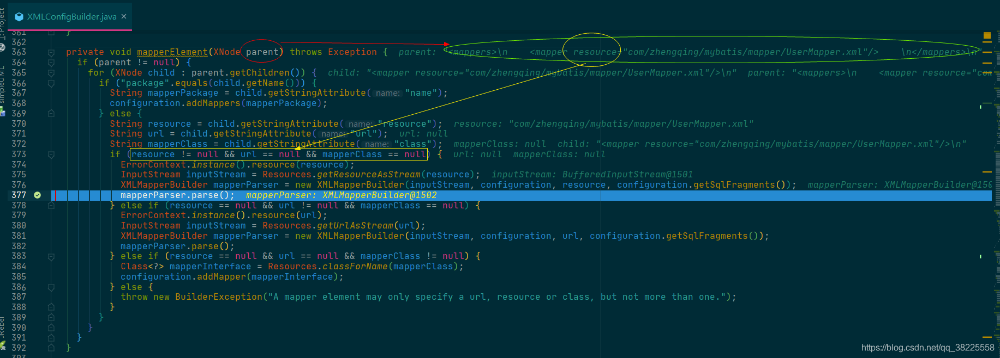
进入`mapperParser.parse()`

这里因此我们的sql是select语句，因此直接进入`buildStatementFromContext(context.evalNodes("select|insert|update|delete"))`

注意此时list中的就是我们mapper中的sql语句

然后进入`statementParser.parseStatementNode()`看看mybatis拿到sql内容之后又是怎么做的呢

可以看见mybatis是将`context`中的sql内容一个一个解析成临时的局部变量
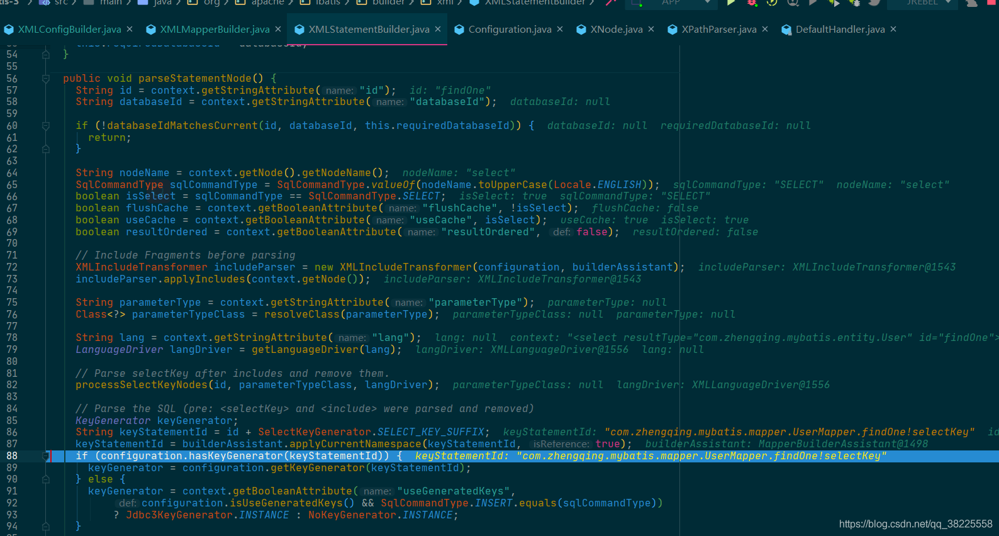
再走到下面，发现解析的变量是在这里被使用，因此进入`builderAssistant.addMappedStatement(...)`方法
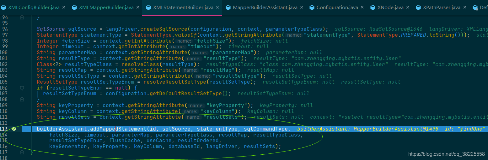
最终可以看见这些变量是存到了`MappedStatement`类中，然后传给`org.apache.ibatis.session.Configuration#mappedStatements`
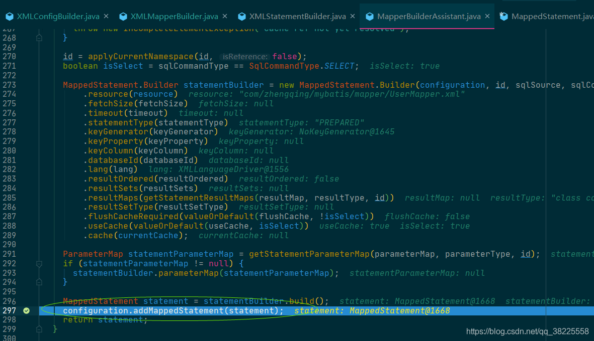

### 六、mybatis操作数据库


进入`configuration.newExecutor(tx, execType)`
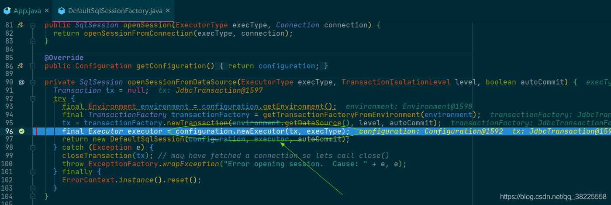
这里可以看见默认返回一个`SimpleExecutor`简单执行器，以及我们的mybatis在这里默认开启一级缓存
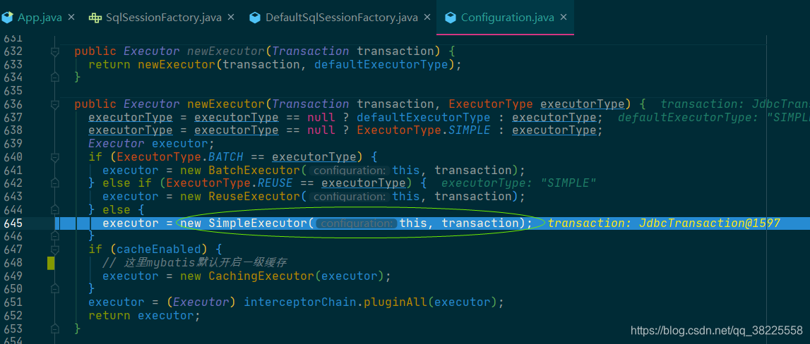
执行完这里会返回一个`DefaultSqlSession`

然后调用`selectOne`方法

进入`selectList`

这里`ms`中含之前获取的sql执行语句，然后进入`executor.query`
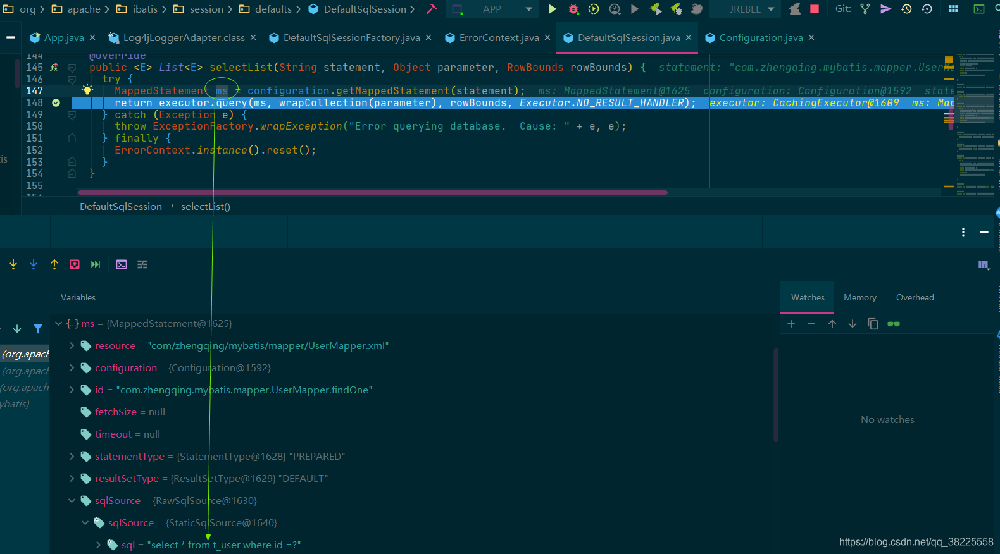

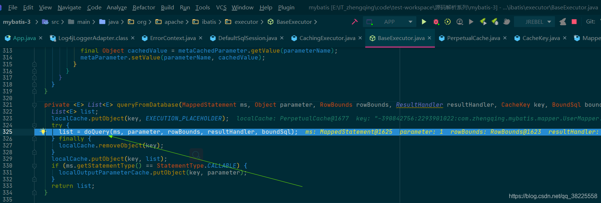
这里可以看见`prepareStatement`方法中拿到我们的`connection`

然后进入`handler.query(stmt, resultHandler)`可以看到拿到了`PreparedStatement`

然后进入`resultSetHandler.handleResultSets(ps)`
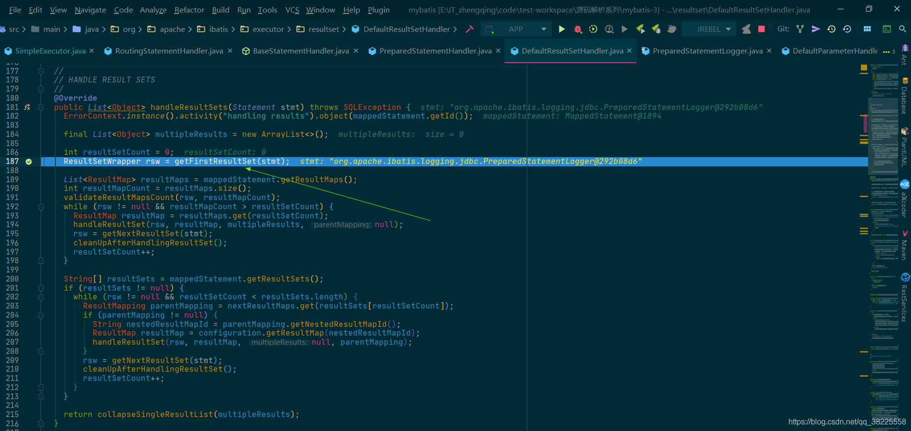
进入`getFirstResultSet(stmt)`方法
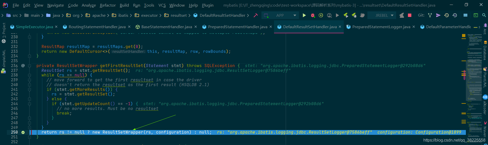
进入`ResultSetWrapper`
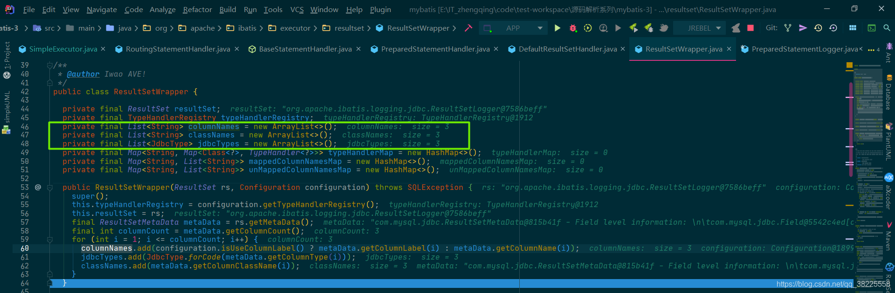
到这里我们就可以明白什么是ORM了！！！

`用于实现面向对象编程语言里不同类型系统数据之间的转换`

`username`字段在数据库中为`VARCHAR`类型，而在Java对象中为`String`类型

最后回到`org.apache.ibatis.executor.BaseExecutor#queryFromDatabase`方法处，`list`中的数据也就是最后sql查询到的结果
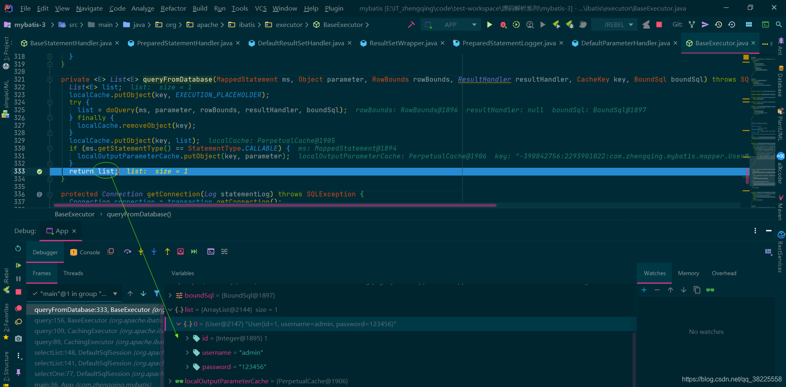
debug结束后，最终完美拿到了我们的数据

现在再来看看这幅图，应该会更容易理解了
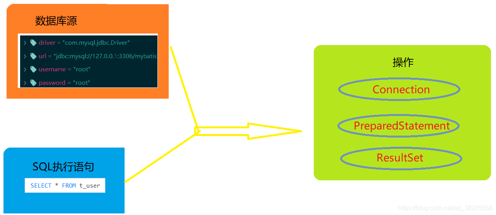

### 七、mybatis执行流程

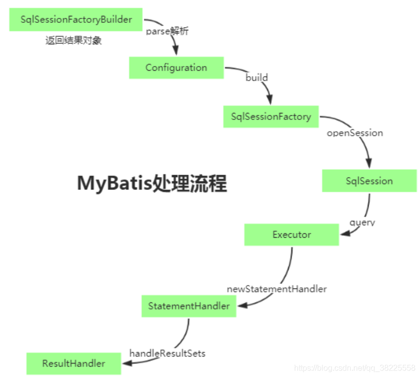
参考：[MyBatis体系结构源码解读](https://www.jianshu.com/p/6b957c494fa8)


